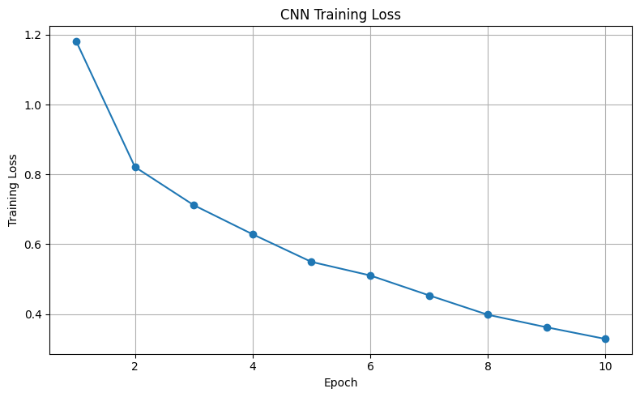
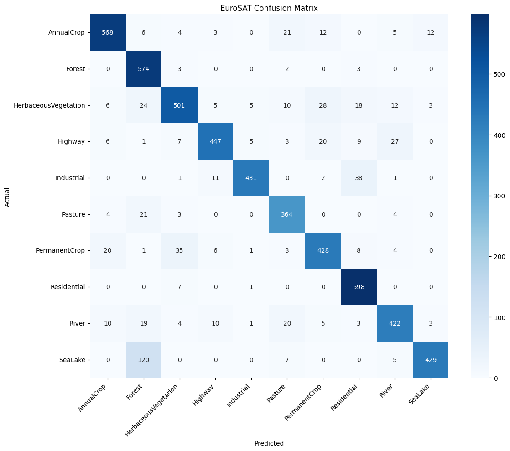

# EuroSAT CNN - Satellite Image Land-Use Classification

## Project Overview

A PyTorch implementation of a custom convolutional neural network for image-level land-use / land-cover classification using the EuroSAT RGB dataset. Given a 64x64 RGB satellite image, the model predicts one of 10 scene categories. This is not a semantic-segmentation project: it assigns one label to each whole image.

## Objective

Train and evaluate a three-block CNN on EuroSAT RGB images while preserving a clear, reproducible experiment structure.

## Dataset

This project uses the EuroSAT RGB dataset: 27,000 Sentinel-2-derived images across 10 labeled classes. The dataset is not included in this repository. Download the RGB dataset from the [official EuroSAT repository](https://github.com/phelber/EuroSAT), extract it, and set data_dir in the notebook to the resulting EuroSAT_RGB directory.

## Classes

AnnualCrop, Forest, HerbaceousVegetation, Highway, Industrial, Pasture, PermanentCrop, Residential, River, and SeaLake.

## Data Split

- Total images: 27,000
- Training images: 21,600 (80%)
- Testing images: 5,400 (20%)
- Input size: 64x64 RGB

The supplied experiment used a seeded 80/20 random split (seed 42).

## Model Architecture

The custom CNN contains three Conv2d + BatchNorm + ReLU + MaxPool blocks.

- Channels: 3 -> 32 -> 64 -> 128
- Classifier: Flatten -> Linear(8192, 512) -> ReLU -> Dropout(0.5) -> Linear(512, 10)

## Training Configuration

| Setting | Value |
| --- | --- |
| Loss | CrossEntropyLoss |
| Optimizer | Adam |
| Learning rate | 0.001 |
| Epochs | 10 |
| Batch size | 32 |
| Random seed | 42 |

## Results

The documented final test accuracy is **88.19%** on the 5,400-image test set. During the supplied 10-epoch run, training accuracy increased from 59.75% to 89.27% and training loss decreased from 1.1819 to 0.3286.

Results from a rerun can differ with hardware, PyTorch, CUDA, and data-loader differences. The committed figures were extracted from the supplied notebook output; they do not represent a new benchmark.

## Classification Metrics

| Class | Precision | Recall | F1-score |
| --- | ---: | ---: | ---: |
| AnnualCrop | 0.93 | 0.90 | 0.91 |
| Forest | 0.75 | 0.99 | 0.85 |
| HerbaceousVegetation | 0.89 | 0.82 | 0.85 |
| Highway | 0.93 | 0.85 | 0.89 |
| Industrial | 0.97 | 0.89 | 0.93 |
| Pasture | 0.85 | 0.92 | 0.88 |
| PermanentCrop | 0.86 | 0.85 | 0.86 |
| Residential | 0.88 | 0.99 | 0.93 |
| River | 0.88 | 0.85 | 0.86 |
| SeaLake | 0.96 | 0.76 | 0.85 |
| Macro average | 0.89 | 0.88 | 0.88 |

## Confusion Matrix

## Sample Predictions

The supplied experiment displayed correctly predicted dataset examples for Forest (98.86% confidence), Highway (99.79%), River (63.88%), and SeaLake (99.94%). Their images are not committed because the EuroSAT dataset is excluded. The notebook includes reusable prediction code for a local image or a dataset sample.

## Model File

The provided checkpoint is available at [models/eurosat_cnn_model.pth](models/eurosat_cnn_model.pth). It contains the model state dictionary, class names, and class-to-index mapping. The notebook includes save/load cells compatible with this architecture.

## How to Run

1. Clone this repository and enter its directory.
2. Create and activate a virtual environment.
3. Install dependencies with pip install -r requirements.txt.
4. Download and extract the EuroSAT RGB dataset from the official source above.
5. Open [notebooks/EuroSAT_CNN_Classification.ipynb](notebooks/EuroSAT_CNN_Classification.ipynb).
6. Set data_dir in Configuration to the extracted EuroSAT_RGB directory.
7. Run the notebook from top to bottom.

## Project Structure

EuroSAT-CNN-Land-Use-Classification/
- README.md
- requirements.txt
- .gitignore
- notebooks/EuroSAT_CNN_Classification.ipynb
- models/eurosat_cnn_model.pth
- results/training_loss.png
- results/confusion_matrix.png
- report/EuroSAT_CNN_Project_Report.pdf

## Technologies Used

Python, PyTorch, Torchvision, NumPy, Matplotlib, Seaborn, scikit-learn, Pillow, and Jupyter.

## Limitations

- The model performs whole-image classification only; it does not identify land-cover regions at the pixel level.
- The fixed 80/20 split is not a geographic or temporal generalization study.
- Performance may vary on different splits, environments, or real-world imagery.
- This is an educational portfolio project, not a production-ready land-monitoring system.

## Future Improvements

- Use validation-based hyperparameter selection and cross-validation.
- Compare data augmentation and pretrained backbones.
- Examine class-specific errors and calibration.
- Evaluate geographic and temporal generalization.
- Use segmentation-labeled data and an appropriate architecture for pixel-level analysis.

## Report

The original project report is available at [report/EuroSAT_CNN_Project_Report.pdf](report/EuroSAT_CNN_Project_Report.pdf).
